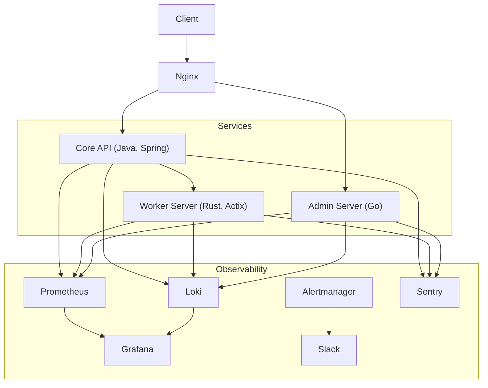

# infra-lab

단일 서버 환경에서 실서비스 수준의 인프라를 직접 구성하고, 의도적으로 장애를 발생시키며 배포, 모니터링, 로깅, 알림, 복구 전 과정을 실습하기 위한 개인 운영 실험실이다.

**서비스 구현이 목적이 아니라 운영 경험 축적**을 목표로 한다.

---

## 프로젝트

- 단일 서버 환경에서 설계한다
- Kubernetes 없이 Docker / Compose 기반으로 운영한다
- 장애를 의도적으로 트리거할 수 있고, 관측, 분석, 대응까지 수행한다
- CI/CD, 모니터링, 로그, 알림을 구성한다

---

## 실행 환경

- Host: Mac mini (단일 물리 장비)
- Container Runtime: Docker (via Colima)
- Orchestration: Docker Compose
- Reverse Proxy: Nginx
- CI/CD: Jenkins
- Monitoring: Prometheus, Grafana
- Logging: Loki
- Error Tracking: Sentry (SaaS)

---

## 서비스 기술 스택
- Core API: Java, Spring Boot
- Worker Server: Rust, Actix Web
- Admin Server: Go

---

## 전체 아키텍처 개요

- 모든 서비스는 Docker 컨테이너로 실행된다
- Nginx가 단일 진입점(Single Entry Point) 역할을 한다
- 내부 서비스는 외부에 직접 노출되지 않는다
- 모니터링, 로깅, 알림은 서비스와 분리된 독립 구성요소로 운영된다

---

## Repository Structure

본 레포지토리는 인프라 오케스트레이션을 위한 단일 진입점 역할을 한다.

```text
infra-lab/
├── README.md
├── docker-compose.yml        # 전체 서비스 정의
├── .env                      # 공통 환경 변수
│
├── nginx/
│   └── nginx.conf            # Reverse Proxy 설정
│
├── monitoring/
│   ├── prometheus/
│   ├── grafana/
│   └── loki/
│
├── ci/
│   └── jenkins/
│
├── core-server/              # 메인 API (Spring) - submodule
├── worker-server/            # 비동기 작업 처리 (Rust) - submodule
├── admin-server/             # 운영/장애 제어 서버 (Go) - submodule
│
├── docs/
│   ├── observability/
│   │   ├── metrics.md        # 메트릭 기반 감지 / 한계
│   │   ├── logs.md           # 로그 기반 분석 흐름
│   │   ├── errors.md         # 에러 트래킹(Sentry) 활용
│   │   └── alerting.md       # 알림은 언제, 무엇을 기준으로 울려야 하는가
│   |
│   ├── infra-components/
│   │   ├── nginx.md          # Nginx 관점의 장애 포인트와 관측 지점
│   │   ├── docker.md         # 컨테이너 레벨 장애/리소스 이슈
│   │   ├── ci-cd.md          # 배포 과정에서의 실패 시나리오
│   │   └── monitoring-stack.md
│   |
│   ├── failure-experiments/
│   │   ├── cpu-100.md        # CPU 고갈 실험
│   │   ├── memory-leak.md    # 메모리 누수 실험
│   │   ├── nginx-502.md      # Reverse Proxy 장애
│   │   ├── disk-full.md      # 디스크 부족
│   │   └── ex-api-network-delay.md  # 외부 API 네트워크 지연 / 단절
│   |
│   └── checklists/
│       ├── 장애-대응-체크리스트.md
│       └── 복구-후-검증-체크리스트.md
│
└── README.md
```

---

## 전체 아키텍처 다이어그램



---
